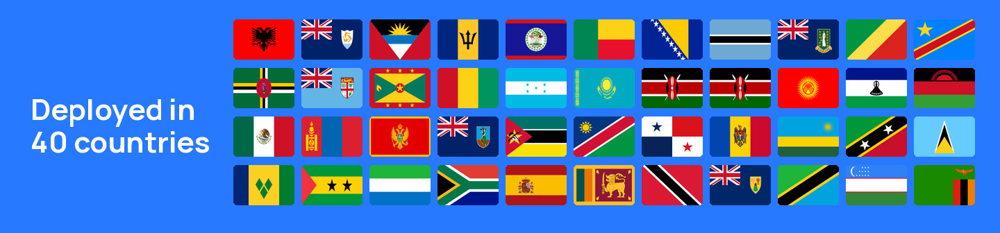

# Introduction

<!-- release-start:v2.0.3 -->

**2.0.3 — 2026-05-20**

Giga Meter can now measure internet speed more accurately, automatically detect your location, and support Mongolian language. The app also has improved security features for signed software distribution.

[Full release notes →](https://github.com/unicef/project-connect-daily-check-app/releases/tag/v2.0.3)

<!-- release-end -->

**Unlock better school connectivity.** Giga Meter helps schools measure, monitor, and improve their internet quality.

Giga Meter is an open-source desktop app developed by [Giga](https://giga.global/) — a UNICEF-ITU initiative to connect every school to the internet. It runs daily automated internet quality tests and syncs results directly to [Giga Maps](https://maps.giga.global/), the global live map of school connectivity.

To date, we are in:

<!-- stats-start -->


## 39

Countries



## 20,944

Schools



## 3,091,134

Measurements


<!-- stats-end -->



### <a href="https://meter.giga.global" class="button primary" data-icon="rotate">Download the app</a>



### <a href="https://superset.giga.global" class="button primary" data-icon="sidebar">Access dashboards</a>



### <a href="https://maps.giga.global" class="button primary" data-icon="earth-asia">View Giga Maps</a>




**Giga Meter 2.0.3 — 2026-05-20**

Giga Meter can now measure internet speed more accurately and identify your location automatically, and the app is now available in Mongolian. The software also includes improvements to how it tracks usage and handles secure updates.

[Full release notes →](https://github.com/unicef/project-connect-daily-check-app/releases/tag/v2.0.3)


***

***

## What's in this documentation

| Section                                                                    | What you'll find                                |
| -------------------------------------------------------------------------- | ----------------------------------------------- |
| [Getting Started](docs/getting-started/overview.md)                        | What Giga Meter is and why it matters           |
| [System Requirements](docs/installation/system-requirements.md)            | What you need before installing                 |
| [Installation Guide](docs/installation/installation-guide.md)              | Step-by-step setup instructions                 |
| [Measurement Protocols](docs/technical-reference/measurement-protocols.md) | How tests work and when they run                |
| [Data Governance](docs/technical-reference/data-governance.md)             | What data is collected and how it's handled     |
| [Troubleshooting](docs/troubleshooting/troubleshooting.md)                 | Common issues and fixes                         |
| [FAQ](docs/troubleshooting/faq.md)                                         | Frequently asked questions                      |
| [Country Deployment](docs/deployment/government-onboarding-overview.md)    | For governments rolling out Giga Meter at scale |
| [Case Studies](docs/deployment/case-studies.md)                            | How other governments use the data              |
