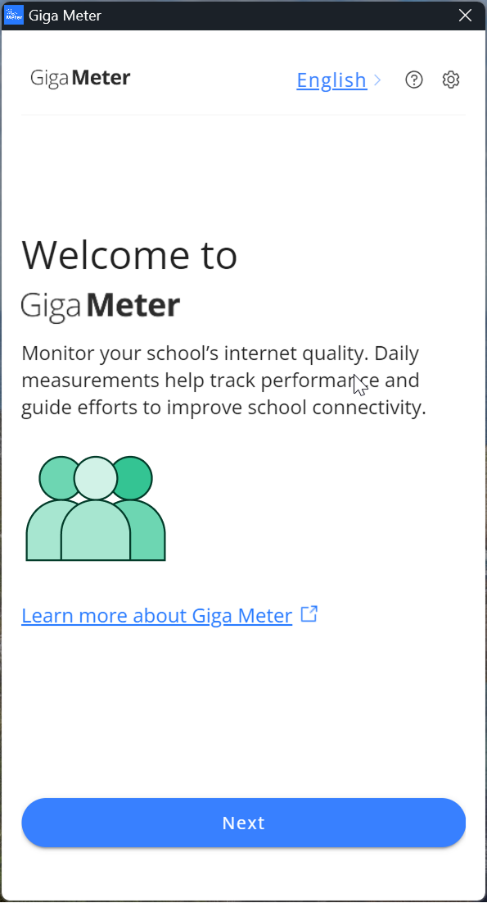
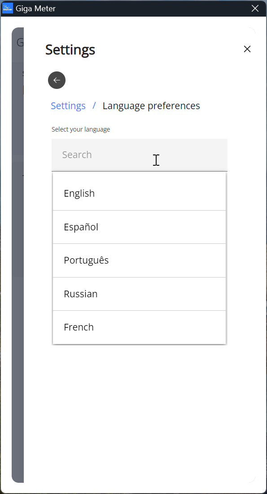
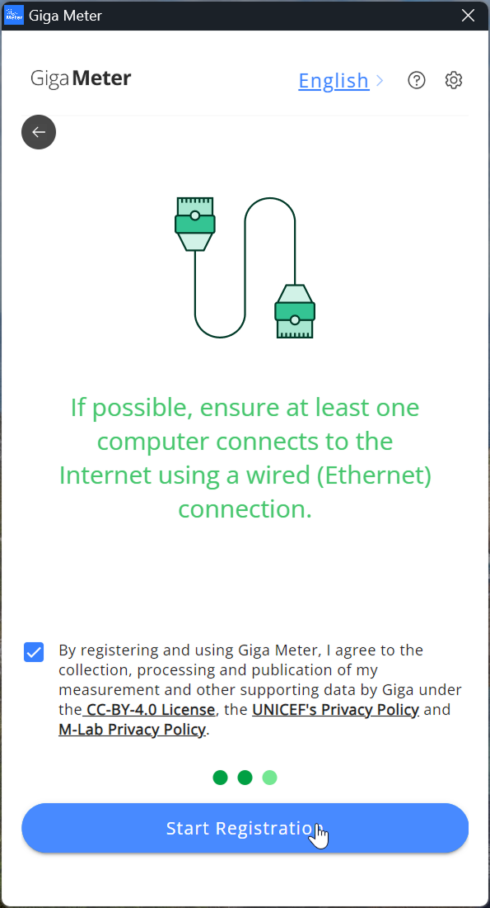
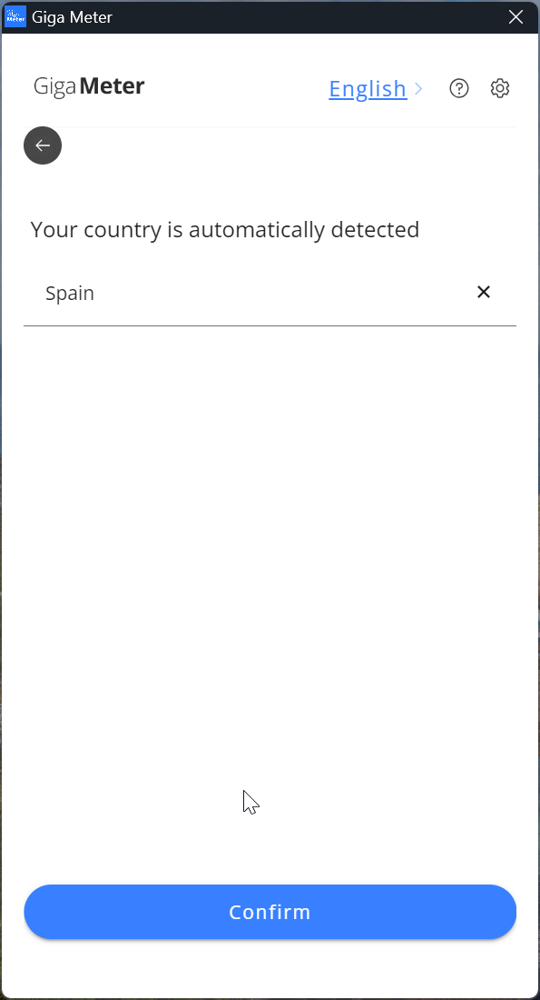
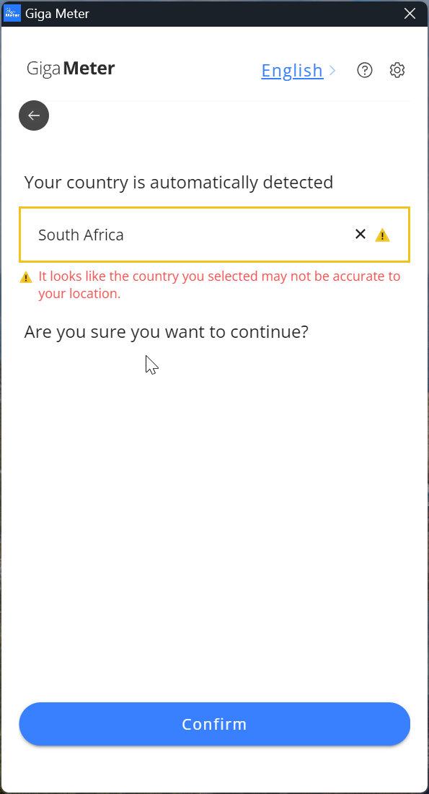
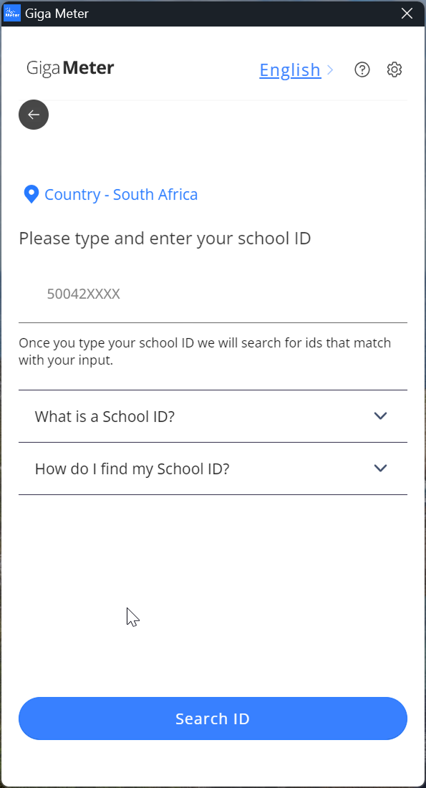
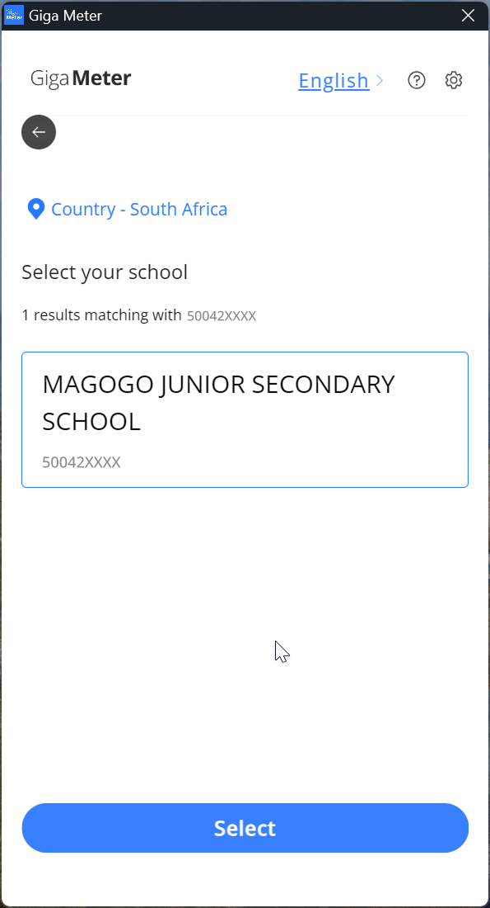
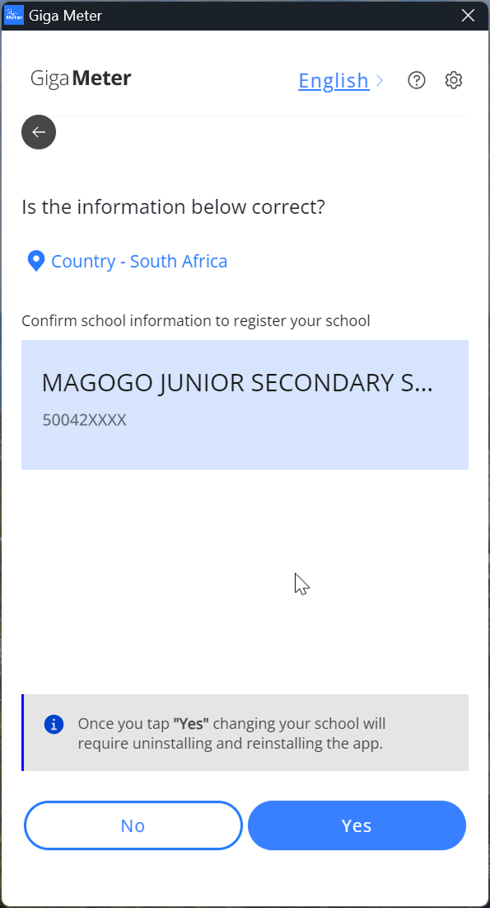
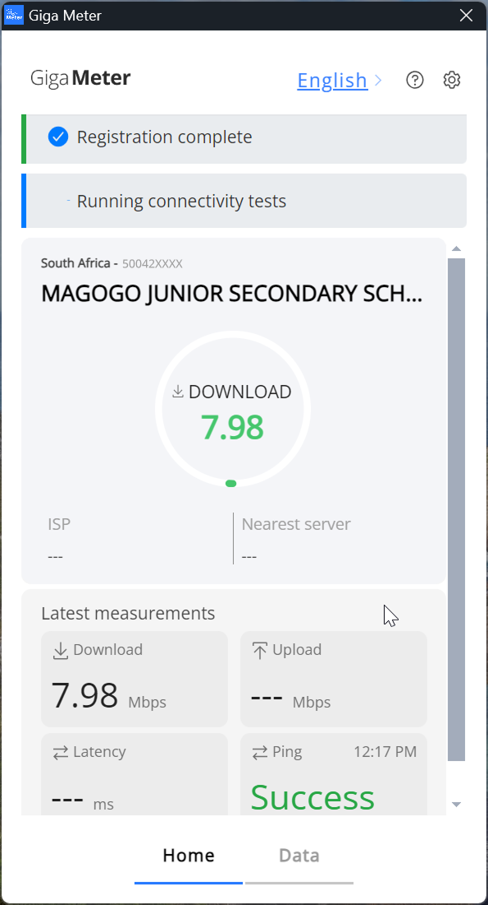
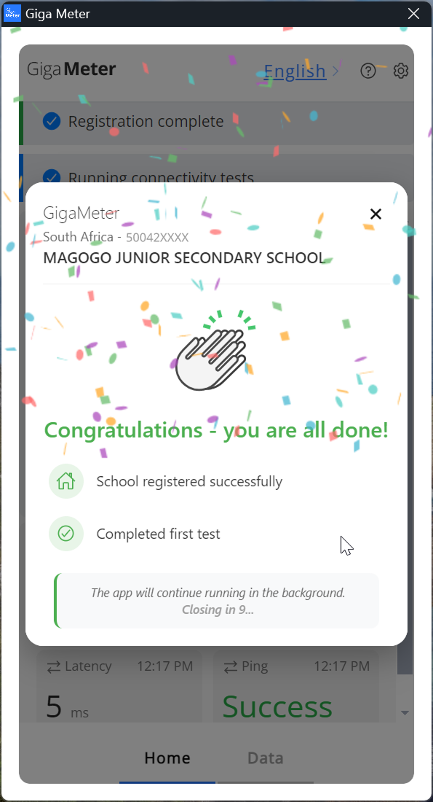

# Installation Guide

Before you start, confirm your device meets the [System Requirements](system-requirements.md).

---

## Step-by-step installation

### Step 1 — Download Giga Meter

Visit [meter.giga.global](https://meter.giga.global/) and click **Download** in the upper right corner.


If you've visited this page before, perform a hard refresh first:
- **Windows:** `Ctrl + Shift + R` or `Ctrl + F5`
- **Mac:** `Cmd + Shift + R`


### Step 2 — Open the downloaded file

Once the download completes, click on the file to open it.


The downloaded file may appear in your browser's bottom bar, in the upper-right downloads icon, or in your **Downloads** folder.


### Step 3 — Check the version

If messages appear warning about an older version, go back to Step 1 and reinstall the latest version. Otherwise, proceed.

### Step 4 — Allow installation

If prompted by a system message asking for permission, click **Yes**. This opens the Setup Wizard.

### Step 5 — Choose installation scope

On the Setup Wizard, select **"Anyone who uses this computer (all users)"** and click **Next**.

### Step 6 — Choose destination folder

Select the destination folder where you want to save the application and click **Install**.

### Step 7 — Finish the setup

On the Setup Wizard, click **Finish**.

### Step 8 — Open Giga Meter

Navigate to your Desktop. You should see the Giga Meter shortcut icon. Click it to open the application.

---

## Registration

### Step 9 — Start registration



Follow the registration steps shown in the app. Click **Next** to move through the onboarding screens.

The app will remind you to:
- Install only on computers connected exclusively to the school's internet
- Register up to two devices per school


<figure><figcaption></figcaption></figure>



### Step 10 — Select your language



To change the language, click **English** in the top right corner and select from the list.


<figure><figcaption></figcaption></figure>



### Step 11 — Accept the policies



Read the set-up recommendations. Accept the **Data Privacy Policy** and **Data Sharing License** by checking the box.

Click **Start Registration** to continue.


<figure><figcaption></figcaption></figure>



### Step 12 — Confirm your country



Your country should be detected automatically. Click **Confirm** to continue.


If the detected country is incorrect, select the correct one from the dropdown and click **OK**. Then click **Confirm** to continue.



<figure><figcaption></figcaption></figure>



### Step 13 — Country verification errors



**"It looks like the country you selected may not be accurate"**\
Double-check your country selection. If correct and the message still appears, this may be caused by a VPN or IP address signaling a different country. You can continue by clicking **Confirm**.

**"Sorry, Giga Meter is not available in [...]"**\
Verify your selected country is correct. If the issue persists, contact your designated Giga Meter focal point at UNICEF or the school administrator who guided the installation.


<figure><figcaption></figcaption></figure>



### Step 14 — Enter your school ID



Enter the school ID — a unique identifier provided by the government — and click **Search ID**. Select your school from the results by clicking **Select**.


If you're unsure of your school ID, check with your school administrator or IT department.



<figure><figcaption></figcaption></figure>
<figure><figcaption></figcaption></figure>



### Step 15 — Confirm the school name



Double-check the information shown. If the school name is correct, click **YES** to confirm.


Once you click **YES**, changing your school ID will require uninstalling and reinstalling the app.



<figure><figcaption></figcaption></figure>



### Step 16 — First connectivity test



Your school is now registered. The app will automatically run the first connectivity test to confirm registration was completed successfully. This may take a moment.


<figure><figcaption></figcaption></figure>



### Step 17 — Installation complete



Congratulations — your installation is complete.

If the test is unsuccessful, try again later when the internet connection improves. If tests fail repeatedly, take a screenshot and share it with the administrator who guided you through the installation.


Your school connectivity will be measured daily and data will be sent to Giga automatically. To ensure accurate data, keep the computer turned on and connected to the school's internet for as many hours as possible each day.



<figure><figcaption></figcaption></figure>



---

## What's next?

- View your school's data on [Giga Maps](https://maps.giga.global/map)
- If you run into issues, see the [Troubleshooting guide](../troubleshooting/troubleshooting.md)
