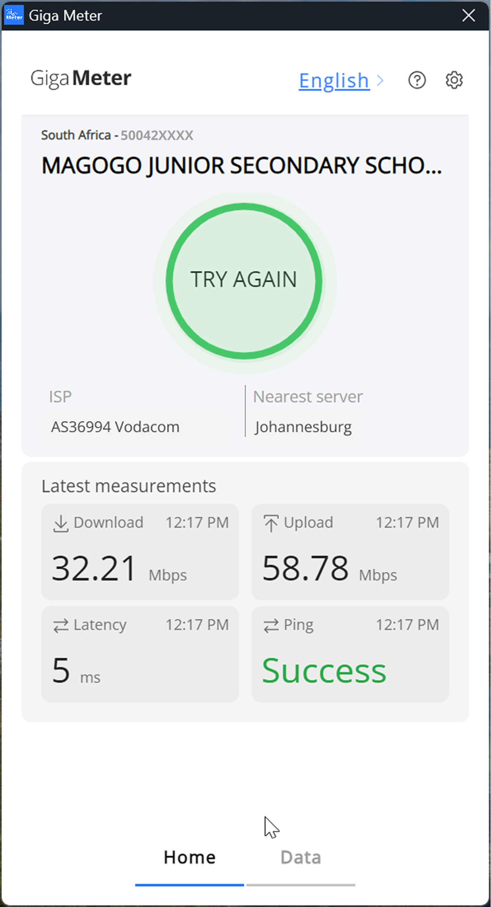
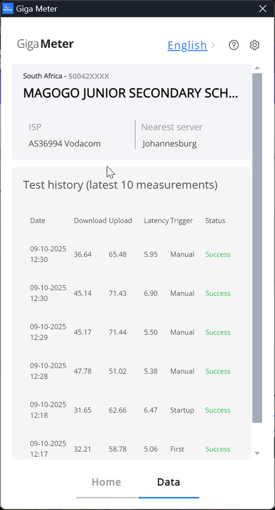

# Troubleshooting

For general questions about how the app works, see the [FAQ](faq.md).

---

**During installation**

Windows shows a SmartScreen warning

<figure><figcaption></figcaption></figure>

This is a standard Windows warning for apps not yet in Microsoft's signature database. The app is published by UNICEF and safe to install.

1. Click **More info**
2. Click **Run anyway**

Windows asks for permission to make changes (UAC prompt)

<figure><figcaption></figcaption></figure>

Click **Yes**. The publisher shown is UNICEF. This opens the Setup Wizard.

If you do not have admin rights on the device, contact your IT department before proceeding.

App warns that you have an old version

1. Visit [meter.giga.global](https://meter.giga.global/)
2. Download and install the latest version

The new version overwrites the old one automatically. Your school registration is preserved — you do not need to register again.

---

**During registration**

School not found after entering the ID

1. Check for spaces before or after the ID — remove them and search again.
2. If the ID starts with a zero (`0`), try omitting the leading zero and searching again.
3. Try searching by school name instead.
4. If the school still does not appear, contact your focal point at the Ministry or UNICEF Country Office — the school may not yet be in Giga's system.

Wrong country detected

<figure><figcaption></figcaption></figure>

Select the correct country from the dropdown, click **OK**, then **Confirm**.

If a warning still appears after selecting the correct country, it may be caused by a VPN or your IP address signalling a different location. You can proceed by clicking **Confirm**.

If the message says **"Giga Meter is not available in \[country]"** and your country selection is correct, contact your Giga focal point at UNICEF — the country may not yet be whitelisted.

Registered with the wrong school ID

1. Open Giga Meter and go to **Settings**
2. Click **Logout**, enter your school ID, and click **Logout** again to confirm
3. You will return to the registration screen — follow [Step 11 of the Installation Guide](../installation/installation-guide.md#step-11--accept-the-policies) to re-register with the correct ID


Logging out removes the registration for all users on this device. No measurements will be recorded until re-registration is complete.


After re-registering, check any other Windows user accounts on the device and open Giga Meter to confirm they show the correct school. If not, restart the app and register again.

---

**After installation**

Tests are not running or keep failing

<figure><figcaption></figcaption></figure>

Work through this checklist:

* [ ] Is the device **turned on** and not in Sleep mode?
* [ ] Is it connected to the **school's internet** — not a mobile hotspot or personal router?
* [ ] Is it within the measurement window — **8 AM to 8 PM** local time?
* [ ] Does the school have a working internet connection? Test by opening a website.

If all of the above are confirmed and tests continue to fail, take a screenshot of the error and send it to the administrator who guided your installation.

No data appearing on Giga Maps

<figure><figcaption></figcaption></figure>

Data takes up to 24–48 hours to appear after the first successful test.

If nothing appears after 48 hours:

1. Open Giga Meter and check the **Data** tab — confirm at least one test shows as successful.
2. If no tests have run, work through the checklist above.
3. If tests show as successful but Maps still shows nothing, contact your focal point.

School appears as "Unknown" on Giga Maps

The school ID used during registration may not match the record in Giga's database. Verify the school ID is correct and contact the Giga team via your UNICEF focal point to correct the mapping.

---

For anything not listed here: take a screenshot or copy the exact error message and send it to your focal point at the Ministry or UNICEF Country Office.

* [FAQ](faq.md)
* [Installation Guide](../installation/installation-guide.md)
