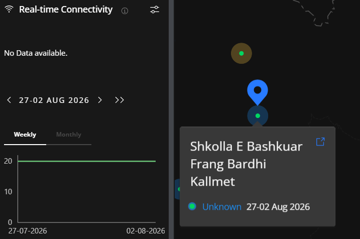
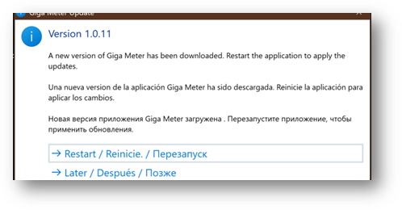

# FAQ

1. [Чӣ тавр метавонам маълумоти мактаби худро бинам?](faq.md#чи-тавр-метавонам-маълумоти-мактаби-худро-бинам)
2. [Giga Meter кадом маълумотро ба Giga интиқол медиҳад?](faq.md#giga-meter-кадом-маълумотро-ба-giga-интиқол-медиҳад)
3. [Оё Giga ба маълумоти дигари компютери ман дастрасӣ дорад?](faq.md#оё-giga-ба-маълумоти-дигари-компютери-ман-дастрасӣ-дорад)
4. [Кӣ ба маълумоти пайвастшавии мактаби ман дастрасӣ хоҳад дошт?](faq.md#кӣ-ба-маълумоти-пайвастшавии-мактаби-ман-дастрасӣ-хоҳад-дошт)
5. [Рақами мактаб (ID) чист?](faq.md#рақами-мактаб-id-чист)
6. [Чӣ тавр рақами мактаби худро (ID) пайдо кунам?](faq.md#чи-тавр-рақами-мактаби-худро-id-пайдо-кунам)
7. [Оё метавонам барномаро пӯшам?](faq.md#оё-метавонам-барномаро-пӯшам)
8. [Чӣ тавр барномаро навсозӣ кунам?](faq.md#чи-тавр-барномаро-навсозӣ-кунам)
9. [Санҷиши суръат кай иҷро мешавад?](faq.md#санҷиши-суръат-кай-иҷро-мешавад)
10. [Натиҷаҳои ченкунии пешинаро дар куҷо дида метавонам?](faq.md#натиҷаҳои-ченкунии-пешинаро-дар-куҷо-дида-метавонам)
11. [Оё метавонам рақами мактаби худро (ID) иваз кунам?](faq.md#оё-метавонам-рақами-мактаби-худро-id-иваз-кунам)
12. [Оё метавонам Giga Meter-ро дар зиёда аз як компютер насб кунам?](faq.md#оё-метавонам-giga-meter-ро-дар-зиёда-аз-як-компютер-насб-кунам)
13. [Giga Meter ба кадом намуди маълумот дастрасӣ дорад?](faq.md#giga-meter-ба-кадом-намуди-маълумот-дастрасӣ-дорад)
14. [Giga Meter чӣ тавр ба беҳтар шудани дастрасии интернет мусоидат мекунад?](faq.md#giga-meter-чи-тавр-ба-беҳтар-шудани-дастрасии-интернет-мусоидат-мекунад)

***

#### Чӣ тавр метавонам маълумоти мактаби худро бинам?

Шумо натиҷаҳоро ба ду тарз дида метавонед:

1. **Дар барнома** — 10 ченкунии охирини муваффақ дар саҳифаи "Data"-и барнома нишон дода мешавад.
2. **Дар Giga Maps** — ба [maps.giga.global/map](https://maps.giga.global/map) ворид шавед, номи мактаб ё рақами мактаб (ID)-и худро дар лавҳаи чап нависед ва онро интихоб кунед, то натиҷаҳоро дар тӯли вақт бубинед.

Нуқтаи **дурахшон** дар назди номи ҳар мактаб вобаста ба сатҳи пайвастшавӣ бо ранг ишора мешавад:

**Сабз** — Пайвастшавии хуб. Мактаб ба меъёри интихобшуда мувофиқ аст ё аз он баланд аст.

<figure><figcaption></figcaption></figure>

**Зард** — Пайвастшавии миёна. Мактаб аз меъёр пасттар аст, аммо пайвастшавии коршаванда дорад.

<figure><figcaption></figcaption></figure>

**Сурх** — Пайвастшавии суст. Мактаб хеле поёнтар аз меъёр аст.

<figure><figcaption></figcaption></figure>

**Кабуд** — Маълумоти охирин дарёфт нашудааст. Мумкин аст дастгоҳ хомӯш бошад ё лозим ояд, ки барнома аз нав насб карда шавад.

<figure><figcaption></figcaption></figure>

Пас аз интихоби мактаби худ, суроғаи (URL)-ро аз навори суроғаи браузери Шумо нусхабардорӣ кунед. Шумо метавонед онро бо мақсади дастрасии бевосита дар оянда захира (bookmark) кунед.

***

#### Giga Meter кадом маълумотро ба Giga интиқол медиҳад?

Барнома танҳо маълумоти самаранокии шабакаро интиқол медиҳад. Он таърихи гаштугузор дар интернет, фаъолияти ҷустуҷӯ ё файлҳои шахсиро ҷамъ намеорад.

| Майдон | Мисол | Ин чист |
| --- | --- | --- |
| **Суръати боргирӣ** | 10 Mbps | Суръате, ки бо он маълумот аз сервери M-Lab ба дастгоҳ мегузарад (протоколи NDT7, санҷиши 10-сонияина) |
| **Суръати боркунӣ** | 5.7 Mbps | Суръате, ки бо он маълумот аз дастгоҳ ба сервери M-Lab мегузарад (протоколи NDT7, санҷиши 10-сонияина) |
| **Таъхир** | 3 ms | Вақти рафту баргашти як бастаи хурди маълумот аз дастгоҳ то сервер ва баръакс |
| **Гум шудани баста** | 0.5% | Фоизи бастаҳои фиристодашуда, ки ҳеҷ гоҳ ба ҷои таъиноти худ нарасидаанд |
| **Вақти корӣ (Uptime)** | 99% | Ҳиссаи соатҳои таълимии мактаб (8:00–20:00), ки давоми онҳо дастрасии пайвастшавӣ бо усули пинг тасдиқ шудааст |
| **ISP / ASN** | AS8193 Uzbektelekom | Провайдери хизматрасонии интернет ва рақами системаи мустақили он (ASN) — як шинос кунандаи ҷаҳонии шабака |
| **Суроғаи IP** | 84.54.71.31 | Суроғаи ошкори IP, ки дар вақти ченкунӣ ба пайвастшавии мактаб таъин шудааст |
| **Ҷойгиршавии сервери санҷишӣ** | Ченнай, Ҳиндустон | Ҷойгиршавии ҷуғрофии сервери ченкунии M-Lab, ки дар санҷиши суръат истифода шудааст |
| **Навъи дастгоҳ** | windows | Системаи амалиётие, ки барномаи ченкунӣ дар он кор мекунад |
| **Номи шабака (SSID)** | MERCUSYS\_43A4 | Номи шабакаи Wi-Fi, ки дастгоҳ дар вақти санҷиш ба он пайваст будааст |
| **Стандарти Wi-Fi** | 802.11n | Версияи протоколи Wi-Fi дар истифода (802.11n = Wi-Fi 4, 802.11ac = Wi-Fi 5, 802.11ax = Wi-Fi 6) |
| **Каналаи Wi-Fi** | 10 | Каналаи басомади радиоӣ, ки роутер дар он пахш мекунад |
| **Сатҳи сигнали Wi-Fi** | -70.5 dBm | Қуввати сигнали дарёфтшуда аз ҷониби дастгоҳ. Ҳар қадар ба 0 наздиктар — қувваттар; поёнтар аз -80 dBm — сифати паст |
| **Суръати интиқоли Wi-Fi** | 300 Mbps | Суръате, ки бо он адаптери бесими дастгоҳ маълумотро ба роутер мефиристад (суръати пайванди бесим) |
| **Модели адаптери Wi-Fi** | Intel Wireless-AC 9560 | Модели сахтафзори адаптери Wi-Fi дар дастгоҳи ченкунӣ |

***

#### Оё Giga ба маълумоти дигари компютери ман дастрасӣ дорад?

Не. Барнома ба ягон маълумоти дигар, ки дар компютери Шумо нигоҳ дошта мешавад, ба ғайр аз ченкуниҳои шабакае, ки дар боло тавсиф шудаанд, дастрасӣ надорад.

***

#### Кӣ ба маълумоти пайвастшавии мактаби ман дастрасӣ хоҳад дошт?

Натиҷаҳои суръати боркунӣ, суръати боргирӣ, таъхир ва пинг якҷоя бо маълумот дар бораи мактаби бақайдгирифташуда ба таври оммавӣ дастрас карда мешаванд. Ин маълумот дар Giga Maps нишон дода мешавад. Ягон маълумоти шахсӣ мубодила карда намешавад.

***

#### Рақами мактаб (ID) чист?

Рақами мактаб (ID) як шинос кунандаи ягонаи мактаби Шумо мебошад, ки аз ҷониби давлат пешниҳод карда мешавад. Формат вобаста ба кишвар фарқ мекунад, аммо одатан шакли `BR12345` ё `12345678`-ро дорад.

***

#### Чӣ тавр рақами мактаби худро (ID) пайдо кунам?

Аз маъмури мактаб ё шӯъбаи технологияи иттилоотии мактаби худ пурсед. Рақами мактаб (ID) рақамест, ки дар низоми миллии бақайдгирии мактабҳо истифода мешавад.

***

#### Оё метавонам барномаро пӯшам?

Бале. Пахши тугмаи пӯшидан танҳо равзанаро мепӯшад, аммо барнома дар паси парда идома кор карда, ҳолати пайвастшавии Шуморо гузориш медиҳад.

***

#### Чӣ тавр барномаро навсозӣ кунам?

Вақте ки версияи нав дастрас мешавад, як огоҳиномаи пайдошуда намоён мегардад; барои навсозӣ ба **Restart** (аз нав оғоз кунед) пахш кунед. Шумо инчунин метавонед ҳар вақт ба [meter.giga.global](https://meter.giga.global/) ворид шуда, версияи охиринро зеркашӣ ва насб кунед.

***

#### Санҷиши суръат кай иҷро мешавад?

Дар як рӯз то чор санҷиши суръат иҷро мешавад:

* Санҷиши аввал: дар давоми 15 дақиқа пас аз рӯшан шудани дастгоҳ
* Санҷишҳои боқимонда: дар доираи вақтҳои 8:00–12:00, 12:00–16:00 ва 16:00–20:00 (бо вақти маҳаллӣ)

Санҷишҳои пинг ҳар 15 дақиқа дар байни соати 8:00 ва 20:00 бо вақти маҳаллӣ иҷро мешаванд.

Шумо ҳамчунин метавонед ҳар вақт санҷиши дастиро оғоз кунед.

***

#### Оё метавонам рақами мактаби худро (ID) иваз кунам?

Агар Шумо бо рақами мактаби нодуруст бақайд гирифта шуда бошед, метавонед бақайдгириро бекор карда, аз нав бақайд гиред. Ба сафҳаи [Ҳалли мушкилот — Бо рақами нодурусти мактаб бақайд гирифта шудам](../docs/troubleshooting/troubleshooting.md) нигаред.

***

#### Оё метавонам Giga Meter-ро дар зиёда аз як компютер насб кунам?

Бале. Як компютер барои оғоз кофӣ аст, аммо Шумо метавонед то 5 дастгоҳро дар як мактаб бақайд гиред. Агар якчанд дастгоҳ аз ҳамон як мактаб маълумот гузориш диҳанд, ченкуниҳо бовариноктар мешаванд ва агар яке хомӯш шавад, дастгоҳи дигар захира хоҳад буд.

***

#### Giga Meter ба кадом намуди маълумот дастрасӣ дорад?

Giga Meter мустақиман пайвастшавии интернетро ислоҳ намекунад, аммо мушкилотро намоён месозад. Ин маълумот ба давлатҳо ва провайдерон кӯмак мекунад, ки ҷойҳои ниёзманд ба беҳбудиро муайян ва мутобиқи авлавият ҳал кунанд.

***

Барои маълумоти иловагӣ, ба [meter.giga.global](https://meter.giga.global/) ё қисми кӯмак дар дохили барнома муроҷиат кунед.
